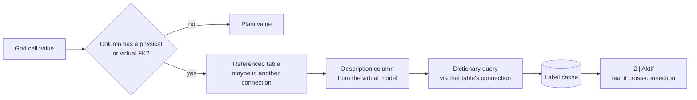

# dbeaver-mm

🇹🇷 **[Türkçe dokümantasyon → README.tr.md](README.tr.md)**


> **dbeaver-mm: see what every ID means, and pick values instead of typing them.**

---

## 📌 About the Project and Problem Statement

In a normalized database most columns hold IDs: `order_type_id = 2`, `service_id = 14`. To find out what an ID means,
an analyst has to write a join or open the dictionary table in another tab. To filter or query by a value, they look
the ID up somewhere else and type it in by hand. It gets worse when the data is spread over several connections, for
example test data in one database and configuration in another. Stock DBeaver can show a referenced value only
through separate editors, and its SQL editor is bound to one connection at a time.

dbeaver-mm is a fork of [DBeaver Community](https://github.com/dbeaver/dbeaver) that shows the meaning of an ID where
the ID appears (grid, filter box, SQL editor) and opens a searchable picker wherever an ID has to be written. It also
works across connections. Everything runs on the client side on top of DBeaver's own model: physical foreign keys,
virtual foreign keys and the virtual model's description column. It needs no server component, no PRO features and
no separate rule engine, so it stays a thin layer over upstream DBeaver.

## ✨ Key Features

* **FK dictionary labels in the grid:** A foreign key cell shows the referenced description next to the ID
  (`2 | Aktif`). A header button chooses the label column and the choice is saved in the virtual model. Labels
  reached through a virtual FK into *another connection* are painted teal.
* **Value pickers everywhere:** A searchable Value / Description popup is available in dictionary FK cells, empty
  (`[NULL]`) ones included. Typing `column =` in the result filter box or `fk_column =` / `column IN (` in the SQL
  editor opens a list of values with their labels. Searches run in the database and ignore case and accents
  (`müşteri` finds `Musteri`).
* **Multi-connection SQL editor:** A connections bar chooses which connections a script may use. The editor switches
  to the connection that holds the statement's tables. Table names are completed across connections
  (`Table | Connection`), and connection short codes (`<code>.`) narrow the list to a single connection.
* **Script tools:** A Recent SQL Scripts panel shows the last 10 scripts as cards with their WHERE conditions, with
  favorites pinned on top. A parameter form (`Ctrl+Alt+P`) edits every `column = value` condition of a script in one
  place.
* **IDs for new rows:** *Edit › Fetch IDs for new rows* asks the id API for as many ids as there are new rows
  with an empty key and writes them into the grid without saving. The API is called through the user's own
  `~/.dbeaver-mm/id-api.sh <count> <table> <domain>` script; the domain is chosen once per connection.
* **Conf packages:** *Edit › Add changes to conf package ...* turns the grid's unsaved changes into SQL (the same
  script as *Generate SQL*) and appends it to `Scripts/conf/<task id>.sql`, whose first line is the task
  description. The grid changes can be discarded right away, so the tab closes without saving to the database.
  The in-cell FK picker lists rows that exist only in conf packages first, marked `[conf <task id>]`.
  *Window › Conf Packages* opens a bottom panel: packages newest first, the selected one's INSERTs as a row
  grid per table and its whole SQL on a second tab. It refreshes itself when a package changes. FK columns show
  `value | label` like the grid; right click or Ctrl+C copies a cell's value, *Copy row* the whole row.
  A row's FK value and the row it references in the same package share a background color. Right click ›
  *Delete row ...* removes a row from the package, alone or with the rows below it down to a chosen level; rows
  left pointing at a deleted row are listed as a warning. Copy buttons put the package's script on the clipboard,
  one per schema it writes to (e.g. *Copy pcm*, *Copy domain_config*) plus *Copy all*, without the description line.
  Copied scripts run without FK errors: DELETEs child tables first, INSERTs parent rows first, then UPDATEs.
* **Easier reading:** Group rows by a column in two alternating colors. The navigator shows tables directly and puts
  views, indexes and other objects into one *Other objects* node.

## 🛠 Tech Stack

* **Language / platform:** Java 21 (`JavaSE-21`), Eclipse RCP / OSGi bundles
* **UI:** SWT and JFace; the data grid is DBeaver's `LightGrid` (`SpreadsheetPresentation`); SQL editing uses the
  Eclipse text framework
* **Data access:** JDBC through DBeaver's model (`DBSEntityAssociation`, virtual model `DBVEntity`, dictionary queries)
* **Build:** Apache Maven + Eclipse Tycho; OSGi dependencies come from Eclipse P2 repositories
* **Base:** DBeaver Community (`devel`), plus the repositories listed in `project.deps` (`dbeaver-common`,
  `datadam-api`)
* **AI / ML:** None in the fork's features (upstream DBeaver's own AI features are unchanged)

## 🏗 System Architecture and How It Works

The fork changes a few upstream bundles and adds two of its own:

| Bundle | Role in the fork |
|---|---|
| `org.jkiss.dbeaver.ui.editors.data` | Grid FK labels, header label button, in-cell picker, filter box values, row grouping |
| `org.jkiss.dbeaver.ui.inlinefkpicker` (new) | SQL FK picker, connections bar logic, auto connection, table completion, short codes, parameter form |
| `org.jkiss.dbeaver.ui.recentscripts` (new) | Recent SQL Scripts panel |
| `org.jkiss.dbeaver.ui.editors.sql` | Connections bar on top of the SQL editor |
| `org.jkiss.dbeaver.ui.navigator` | *Other objects* node |

Fork changes inside upstream code are marked with `// dbeaver-mm` comments.

Flow of an FK label, from a cell to the screen:



The pickers reuse the same path. The filter box, the in-cell popup and the SQL picker all ask for "values of the
referenced table with labels, matching this text" through one shared helper (`FkDictionaryLabels`). The search runs as
a database query on the right connection, and its results are folded for case and accents. In the SQL editor, the
caret analyzer (`SqlCaretAnalyzer`) reads the statement's `FROM` list and aliases to find the column's table. The
connection selector then looks for that table among the candidate connections, reading only their cached table lists
and never their data.

A missing label is never cached: if metadata is not loaded yet the cell shows the plain value, and the label appears
once metadata arrives.

## 🚀 Quick Start

**Prerequisites:** JDK 21, Apache Maven 3.9+, Git, about 4 GB of free disk space. Close any running DBeaver before you
build.

```bash
# All repositories must sit in the same parent folder
mkdir -p ~/dbeaver-dev && cd ~/dbeaver-dev
git clone https://github.com/dbeaver/dbeaver-common.git
git clone https://github.com/dbeaver/datadam-api.git
git clone https://github.com/miracmenekse/dbeaver-mm.git

# Full product build (Community edition)
cd dbeaver-mm
mvn package -f product/aggregate/pom.xml -T1C -Pproduct-dbeaver-ce

# The built product (one folder per platform) is under:
ls product/community/target/products/
```

No environment variables are required. On Linux with a dark GTK theme, start with `GTK_THEME=Adwaita:light` if the
grid looks wrong.

**Demo data:** The repository root has two SQLite scripts. Run them in DBeaver with `Alt+X`, then press `F5` on the
connection.
- `bsn_flow_spec_setup.sql`: a table with FKs to three dictionary tables.
- `cross_connection_fk_setup.sql`: data for a second connection, to try cross-connection virtual FKs.

## 💡 Usage & Examples

**1. Reading a result grid** (demo data from `bsn_flow_spec_setup.sql`)

```sql
SELECT id, label, status_id, priority_id FROM bsn_flow_spec;
```
```text
id  | label  | status_id      | priority_id
----+--------+----------------+-------------
100 | akis A | 2 | Aktif      | 3 | Yuksek
101 | akis B | 1 | Yeni       | 1 | Dusuk
102 | akis C | 3 | Tamamlandi | 2 | Orta
```

**2. Filtering by a label instead of an ID**

```text
Filter box input:   status_id = tamam
Proposals:          3 | Tamamlandi
After picking:      status_id = 3
```

**3. Writing SQL across connections** (demo data from `cross_connection_fk_setup.sql`;
`cfg` is the short code given to the `mm_config_db` connection)

```text
You type:           select * from cfg.serv
Proposals:          service_spec | mm_config_db
After picking:      select * from service_spec      (editor switched to mm_config_db)

You type:           select * from bsn_flow_spec where service_id =
Proposals:          10 | Faturalama
                    20 | Musteri Yonetimi
                    30 | Siparis Yonetimi
After picking:      ... where service_id = 20       (labels read from mm_config_db)
```

## 🗺 Roadmap

- [x] v0.1: FK dictionary labels, Recent SQL Scripts panel, inline FK picker, parameter form
- [x] Cross-connection FK labels and pickers (K1–K14)
- [x] Database-side, accent-blind value search in the filter box (K15–K20)
- [ ] Independent label column per FK column (today the choice is shared per referenced table)
- [ ] Value picker for `INSERT` / `UPDATE ... SET` positions
- [ ] Screenshots and a short demo video
- [ ] Prebuilt releases

## 📄 License & Contributing

dbeaver-mm is licensed under the [Apache License 2.0](LICENSE.md), like DBeaver Community. Every Java file starts with
the Apache 2.0 header in `docs/license_header.txt`.

Issues and pull requests are welcome. Please:
- Mark fork changes in upstream files with a `// dbeaver-mm` comment.
- Build on DBeaver's existing model (FKs, virtual model) instead of adding parallel mechanisms.
- Number commits `K<n>: <what changed>` and add a row to the development history below.

For upstream DBeaver documentation, drivers and downloads, see [dbeaver/dbeaver](https://github.com/dbeaver/dbeaver).

---

## dbeaver-mm development history

Each step of the fork, oldest first, so you can follow how the product grew. Items are numbered `K<n>` in commit messages.

| Step | Date | Change |
|---|---|---|
| [PR #1](https://github.com/miracmenekse/dbeaver-mm/pull/1) v0.1 | 2026-08-15 | First release. **FK dictionary labels** in the grid (`2 \| MAIN_ORDER`) with a header button that chooses the label column. New **Recent SQL Scripts** panel with favorites. New **inline FK picker** after `=` / `IN (` in the SQL editor, plus the **script parameter form** (`Ctrl+Alt+P`). |
| K1–K2 | 2026-09-19 | FK labels resolved through **cross-connection virtual FKs** (painted teal). `column =` in the result filter box lists dictionary values with labels. The SQL picker can choose its label column, shared with the grid. |
| K3–K6 | 2026-09-19 | **Group rows by column** in two alternating colors. **Simpler navigator** with an *Other objects* node. **In-cell FK dropdown** writes the picked value as an edit. The SQL editor **picks the connection automatically** from the statement's tables. |
| K7–K10 | 2026-09-20 | The filter box lists values of plain columns too. The cell picker becomes a **searchable popup**. **Column completion after WHERE / AND / OR** across connections. New **connections bar** on top of the SQL editor. |
| K11 | 2026-09-20 | **Table name completion across connections** after `from` / `join` / `into` / `update`. Accepting a table switches the connection. |
| K12–K13 | 2026-09-20 | **Accent- and case-blind search** (Turkish letters folded). No duplicated label when a column is its own label. **Connection short codes** (`<code>.` lists only that connection's tables). |
| K14 | 2026-09-22 | The SQL FK picker follows the real or virtual FK into another connection. The cell picker stays on screen near the bottom edge. |
| K15 | 2026-09-28 | A value picked in the filter box replaces the typed search text. |
| K16 | 2026-09-28 | The filter box value search runs **in the database**, not only in the first 50 rows. |
| K17 | 2026-09-28 | No `[NULL]` in dictionary labels. Accent-blind dictionary search is done in the database. |
| K18 | 2026-09-28 | Value search keeps going after a space inside an open quote. |
| K19 | 2026-09-28 | The connections bar shows each connection's short code. |
| K20 | 2026-09-30 | Option to list **only the values present in the result** in the filter box, labels included. |
| K23 | 2026-10-07 | The in-cell FK dropdown works on **empty (`[NULL]`) cells** too, so a missing value can be picked from the referenced table instead of showing *Can't navigate to NULL value*. |
| K24 | 2026-10-08 | *Fetch IDs for new rows* fills the key of the grid's new rows from the id API through `~/.dbeaver-mm/id-api.sh`; the id domain is asked once per connection. |
| K25 | 2026-10-08 | *Add changes to conf package ...* appends the grid's unsaved changes as SQL to `Scripts/conf/<task id>.sql` and can discard them from the grid. |
| K26 | 2026-10-08 | The in-cell FK picker shows rows inserted in conf packages first, so a new parent row can be picked before it is in the database. |
| K27 | 2026-10-10 | *Conf Packages* bottom panel lists the packages and shows the selected one's inserted rows per table and its SQL; it refreshes as packages change. |
| K28 | 2026-10-10 | Conf Packages panel shows FK labels next to values (physical or virtual FK, also rows only in packages) and copies a cell or row with right click / Ctrl+C. |
| K29 | 2026-10-10 | Conf Packages panel colors related rows: an FK value and the referenced key in the same package share one color per relation. |
| K30 | 2026-10-10 | *Delete row ...* in the Conf Packages panel removes a row from the package alone or with its dependent rows down to a chosen level, and warns about rows left referencing it. |
| K31 | 2026-10-10 | Conf Packages panel copy buttons: the whole script or the statements of one schema (pcm, domain_config, ...), since each schema is sent separately. |
| K32 | 2026-10-10 | Copied conf scripts are in FK-safe order: DELETEs child tables first, INSERTs referenced rows first (also within one table), then the rest; the schema with parent rows comes first. |
