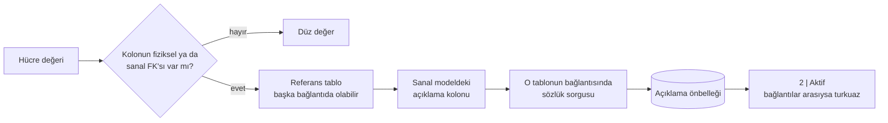

# dbeaver-mm

🇬🇧 **[English README](README.md)**


> **dbeaver-mm: her ID'nin anlamını gör, değeri yazmak yerine seç.**

---

## 📌 Proje Hakkında ve Problem

Normalize bir veritabanında kolonların çoğu ID taşır: `order_type_id = 2`, `service_id = 14`. Bir ID'nin ne anlama
geldiğini öğrenmek için analistin ya join yazması ya da sözlük tablosunu başka bir sekmede açması gerekir. Bir değere
göre filtrelemek ya da sorgu yazmak için ID'yi başka bir yerde bulup elle yazar. Veri birden fazla bağlantıya
dağılmışsa (örneğin test verisi bir veritabanında, konfigürasyon başka birinde) iş daha da zorlaşır. Standart DBeaver
referans verilen değeri yalnızca ayrı editörlerde gösterebilir ve SQL editörü aynı anda tek bir bağlantıya bağlıdır.

dbeaver-mm, [DBeaver Community](https://github.com/dbeaver/dbeaver)'nin bir fork'udur. ID'nin anlamını ID'nin
göründüğü yerde (tablo, filtre kutusu, SQL editörü) gösterir ve ID yazılması gereken her yerde aranabilir bir seçici
açar. Bunların hepsi bağlantılar arasında da çalışır. Her şey istemci tarafında, DBeaver'ın kendi modeli üzerine
kuruludur: fiziksel FK'lar, sanal (virtual) FK'lar ve sanal modeldeki açıklama kolonu. Sunucu bileşeni, PRO özelliği
ya da ayrı bir kural motoru gerekmez. Böylece fork, upstream DBeaver'ın üzerinde ince bir katman olarak kalır.

## ✨ Temel Özellikler

* **Tabloda FK açıklamaları:** FK hücresinde ID'nin yanında referans tablodaki açıklama görünür (`2 | Aktif`).
  Kolon başlığındaki buton hangi kolonun açıklama olacağını seçer, seçim sanal modele kaydedilir. *Başka bir
  bağlantıya* giden sanal FK üzerinden gelen açıklamalar turkuaz renktedir.
* **Her yerde değer seçici:** Sözlük FK hücrelerinde, boş (`[NULL]`) olanlar dahil, aranabilir bir Değer / Açıklama
  penceresi açılır. Filtre kutusuna `kolon =`, SQL editörüne `fk_kolon =` ya da `kolon IN (` yazınca değerler
  açıklamalarıyla listelenir. Aramalar veritabanında yapılır, büyük/küçük harf ve Türkçe karakter farkı
  gözetilmez (`müşteri` araması `Musteri` kaydını bulur).
* **Çok bağlantılı SQL editörü:** Bağlantı çubuğu, betiğin hangi bağlantılarda çalışabileceğini seçer. Editör,
  sorgudaki tabloların bulunduğu bağlantıya kendisi geçer. Tablo adları bağlantılar arasında tamamlanır
  (`Tablo | Bağlantı`). Bağlantı kısa kodları (`<kod>.`) listeyi tek bir bağlantıyla sınırlar.
* **Betik araçları:** Son SQL betikleri paneli son 10 betiği WHERE koşullarıyla birlikte kartlar halinde gösterir,
  favoriler en üstte durur. Parametre formu (`Ctrl+Alt+P`) betikteki tüm `kolon = değer` koşullarını tek yerden
  düzenletir.
* **Yeni satırlara ID:** *Edit › Fetch IDs for new rows*, anahtarı boş yeni satırlar kadar ID'yi ID API'sinden
  alır ve kaydetmeden tabloya yazar. API, kullanıcının kendi `~/.dbeaver-mm/id-api.sh <sayı> <tablo> <domain>`
  betiğiyle çağrılır. Domain her bağlantı için bir kez seçilir.
* **Conf paketleri:** *Edit › Add changes to conf package ...*, tablodaki kaydedilmemiş değişiklikleri SQL'e
  çevirir (*Generate SQL* ile aynı betik) ve ilk satırı task açıklaması olan `Scripts/conf/<task id>.sql`
  dosyasının sonuna ekler. Değişiklikler hemen atılabilir, böylece sekme veritabanına bir şey kaydetmeden
  kapanır. Hücre içi FK seçicisi, yalnızca conf paketlerinde olan satırları `[conf <task id>]` işaretiyle en
  üstte gösterir. *Window › Conf Packages* alt paneli açar: paketler en yeni üstte; seçilenin INSERT'leri
  tablo başına satır ızgarası, tüm SQL'i ikinci sekmede. Paket değişince kendini yeniler. FK kolonları
  grid'deki gibi `değer | etiket` gösterir; sağ tık ya da Ctrl+C hücre değerini, *Copy row* tüm satırı kopyalar.
  Bir satırın FK değeri ile aynı paketteki gösterdiği satır aynı arka plan rengini alır. Sağ tık ›
  *Delete row ...* satırı, altındaki satırları (seçilen seviyeye kadar işaretli) ve üstündeki satırları (işaretsiz)
  tabloda gösterir; pencere açıkken panel silinecekleri kırmızı, onlara bağlı kalanları turuncu gösterir. Birden
  fazla şema varsa panel bunları çizgi ve başlıkla ayırır (ör. *PCM confs*). Kopyala butonları paketin betiğini panoya alır: yazdığı her
  şema için bir buton (ör. *Copy pcm*, *Copy domain_config*) ve *Copy all*; açıklama satırı hariç.
  Kopyalanan betik FK hatası vermeden çalışır: DELETE'ler önce alt tablolar, INSERT'ler önce üst satırlar, sonra UPDATE'ler.
* **Daha kolay okuma:** Satırlar bir kolona göre iki renkle gruplanabilir. Gezgin tabloları doğrudan gösterir;
  view, index ve diğer nesneler tek bir *Other objects* düğümünde toplanır.

## 🛠 Teknolojik Altyapı

* **Dil / platform:** Java 21 (`JavaSE-21`), Eclipse RCP / OSGi bundle'ları
* **Arayüz:** SWT ve JFace. Veri tablosu DBeaver'ın `LightGrid` bileşenidir (`SpreadsheetPresentation`). SQL
  düzenleme Eclipse metin altyapısını kullanır.
* **Veri erişimi:** DBeaver modeli üzerinden JDBC (`DBSEntityAssociation`, sanal model `DBVEntity`, sözlük sorguları)
* **Derleme:** Apache Maven + Eclipse Tycho. OSGi bağımlılıkları Eclipse P2 depolarından gelir.
* **Temel:** DBeaver Community (`devel`) ve `project.deps` dosyasındaki repolar (`dbeaver-common`, `datadam-api`)
* **AI / ML:** Fork'un özelliklerinde yok (upstream DBeaver'ın kendi AI özellikleri değişmeden duruyor)

## 🏗 Sistem Mimarisi ve Çalışma Mantığı

Fork, upstream'deki birkaç bundle'ı değiştirir ve iki yeni bundle ekler:

| Bundle | Fork'taki rolü |
|---|---|
| `org.jkiss.dbeaver.ui.editors.data` | Tablodaki FK açıklamaları, başlık butonu, hücre içi seçici, filtre kutusu değerleri, satır gruplama |
| `org.jkiss.dbeaver.ui.inlinefkpicker` (yeni) | SQL FK seçicisi, bağlantı çubuğu mantığı, otomatik bağlantı, tablo tamamlama, kısa kodlar, parametre formu |
| `org.jkiss.dbeaver.ui.recentscripts` (yeni) | Son SQL betikleri paneli |
| `org.jkiss.dbeaver.ui.editors.sql` | SQL editörünün üstündeki bağlantı çubuğu |
| `org.jkiss.dbeaver.ui.navigator` | *Other objects* düğümü |

Upstream kodundaki fork değişiklikleri `// dbeaver-mm` yorumuyla işaretlidir.

Bir FK açıklamasının hücreden ekrana yolu:



Seçiciler aynı yolu kullanır. Filtre kutusu, hücre içi pencere ve SQL seçicisi, "referans tablonun bu metne uyan
değerleri, açıklamalarıyla" isteğini ortak bir yardımcı üzerinden yapar (`FkDictionaryLabels`). Arama doğru
bağlantıda bir veritabanı sorgusu olarak çalışır, sonuçlar harf ve aksan farkı gözetmeden eşleştirilir. SQL
editöründe imleç çözümleyici (`SqlCaretAnalyzer`), kolonun tablosunu bulmak için sorgunun `FROM` listesini ve
alias'larını okur. Bağlantı seçici sonra bu tabloyu aday bağlantılarda arar. Bunu yaparken yalnızca önbellekteki tablo
listelerini okur, veriye dokunmaz.

Bulunamayan açıklama önbelleğe alınmaz. Metadata henüz yüklenmemişse hücre düz değeri gösterir, metadata gelince
açıklama kendiliğinden görünür.

## 🚀 Hızlı Başlangıç ve Kurulum

**Gereksinimler:** JDK 21, Apache Maven 3.9+, Git, yaklaşık 4 GB boş disk. Derlemeden önce açık olan DBeaver'ı kapat.

```bash
# Tüm repolar aynı üst klasörde olmalı
mkdir -p ~/dbeaver-dev && cd ~/dbeaver-dev
git clone https://github.com/dbeaver/dbeaver-common.git
git clone https://github.com/dbeaver/datadam-api.git
git clone https://github.com/miracmenekse/dbeaver-mm.git

# Ürünün tamamını derle (Community sürümü)
cd dbeaver-mm
mvn package -f product/aggregate/pom.xml -T1C -Pproduct-dbeaver-ce

# Derlenen ürün (her platform için ayrı klasör) burada:
ls product/community/target/products/
```

Ortam değişkeni gerekmez. Linux'ta koyu GTK teması kullanıyorsan ve tablo bozuk görünüyorsa
`GTK_THEME=Adwaita:light` ile başlat.

**Demo verisi:** Repo kökünde iki SQLite betiği var. DBeaver'da `Alt+X` ile çalıştır, sonra bağlantıda `F5`'e bas.
- `bsn_flow_spec_setup.sql`: üç sözlük tablosuna FK ile bağlı bir tablo kurar.
- `cross_connection_fk_setup.sql`: bağlantılar arası sanal FK'yı denemek için ikinci bağlantının verisini kurar.

## 💡 Kullanım Senaryoları

**1. Sonuç tablosunu okumak** (`bsn_flow_spec_setup.sql` demo verisi)

```sql
SELECT id, label, status_id, priority_id FROM bsn_flow_spec;
```
```text
id  | label  | status_id      | priority_id
----+--------+----------------+-------------
100 | akis A | 2 | Aktif      | 3 | Yuksek
101 | akis B | 1 | Yeni       | 1 | Dusuk
102 | akis C | 3 | Tamamlandi | 2 | Orta
```

**2. ID yerine açıklamayla filtrelemek**

```text
Filtre kutusuna yazılan:  status_id = tamam
Öneri:                    3 | Tamamlandi
Seçince:                  status_id = 3
```

**3. Bağlantılar arası SQL yazmak** (`cross_connection_fk_setup.sql` demo verisi;
`cfg`, `mm_config_db` bağlantısına verilen kısa kod)

```text
Yazılan:   select * from cfg.serv
Öneri:     service_spec | mm_config_db
Seçince:   select * from service_spec      (editör mm_config_db'ye geçer)

Yazılan:   select * from bsn_flow_spec where service_id =
Öneriler:  10 | Faturalama
           20 | Musteri Yonetimi
           30 | Siparis Yonetimi
Seçince:   ... where service_id = 20       (açıklamalar mm_config_db'den okunur)
```

## 🗺 Yol Haritası

- [x] v0.1: FK açıklamaları, son SQL betikleri paneli, satır içi FK seçici, parametre formu
- [x] Bağlantılar arası FK açıklamaları ve seçiciler (K1–K14)
- [x] Filtre kutusunda veritabanı tarafında, aksan duyarsız değer araması (K15–K20)
- [ ] Her FK kolonu için bağımsız açıklama kolonu (şu an seçim referans tablo başına ortak)
- [ ] `INSERT` / `UPDATE ... SET` konumlarında değer seçici
- [ ] Ekran görüntüleri ve kısa bir demo videosu
- [ ] Hazır derlenmiş sürümler

## 📄 Lisans ve Katkıda Bulunma

dbeaver-mm, DBeaver Community gibi [Apache License 2.0](LICENSE.md) ile lisanslıdır. Her Java dosyası
`docs/license_header.txt` içindeki Apache 2.0 başlığıyla başlar.

Issue ve pull request'ler açıktır. Lütfen:
- Upstream dosyalardaki fork değişikliklerini `// dbeaver-mm` yorumuyla işaretle.
- Paralel mekanizma eklemek yerine DBeaver'ın mevcut modelinin (FK'lar, sanal model) üzerine kur.
- Commit'leri `K<n>: <ne değişti>` biçiminde numarala ve aşağıdaki gelişim geçmişine bir satır ekle.

Upstream DBeaver dokümantasyonu, sürücüler ve indirmeler için: [dbeaver/dbeaver](https://github.com/dbeaver/dbeaver).

---

## Gelişim geçmişi

Fork'un her adımı eskiden yeniye sıralanmıştır. Commit mesajlarında adımlar `K<n>` diye numaralanır.

| Adım | Tarih | Değişiklik |
|---|---|---|
| [PR #1](https://github.com/miracmenekse/dbeaver-mm/pull/1) v0.1 | 2026-08-15 | İlk sürüm. Tabloda **FK açıklamaları** ve açıklama kolonu seçen başlık butonu. **Son SQL betikleri** paneli (favorilerle). SQL editöründe `=` / `IN (` sonrası **satır içi FK seçici** ve **parametre formu** (`Ctrl+Alt+P`). |
| K1–K2 | 2026-09-19 | **Bağlantılar arası sanal FK** üzerinden çözülen açıklamalar (turkuaz). Filtre kutusunda `kolon =` sözlük değerlerini etiketleriyle listeler. SQL seçicisi etiket kolonunu seçebilir, seçim tabloyla ortaktır. |
| K3–K6 | 2026-09-19 | İki renkli **satır gruplama**. *Other objects* düğümlü **sade gezgin**. Seçimi hücre düzenlemesi olarak yazan **hücre içi FK açılır listesi**. SQL editörü, sorgudaki tablolara bakarak **bağlantıyı kendisi seçer**. |
| K7–K10 | 2026-09-20 | Filtre kutusu düz kolonların değerlerini de listeler. Hücre seçici **aranabilir pencereye** dönüşür. **WHERE / AND / OR sonrası kolon tamamlama** bağlantılar arası çalışır. SQL editörünün üstüne **bağlantı çubuğu** eklenir. |
| K11 | 2026-09-20 | `from` / `join` / `into` / `update` sonrası **bağlantılar arası tablo adı tamamlama**. Seçilen tablo bağlantıyı da değiştirir. |
| K12–K13 | 2026-09-20 | **Aksan ve harf duyarsız arama** (Türkçe harfler katlanır). Kolonun etiketi kendisiyse etiket tekrar edilmez. **Bağlantı kısa kodları** eklenir (`<kod>.` yalnızca o bağlantının tablolarını listeler). |
| K14 | 2026-09-22 | SQL FK seçicisi fiziksel ya da sanal FK'yı başka bağlantıya kadar izler. Hücre seçici ekranın alt kenarında taşmaz. |
| K15 | 2026-09-28 | Filtre kutusunda seçilen değer, yazılan arama metninin yerine geçer. |
| K16 | 2026-09-28 | Filtre kutusundaki değer araması ilk 50 satırda değil, **veritabanında** yapılır. |
| K17 | 2026-09-28 | Sözlük etiketlerinde `[NULL]` gösterilmez. Aksan duyarsız sözlük araması veritabanında yapılır. |
| K18 | 2026-09-28 | Açık tırnak içinde boşluk yazıldıktan sonra da değer araması sürer. |
| K19 | 2026-09-28 | Bağlantı çubuğu her bağlantının kısa kodunu gösterir. |
| K20 | 2026-09-30 | Filtre kutusunda listeyi **yalnızca sonuçta geçen değerlerle** sınırlama seçeneği (etiketleriyle). |
| K23 | 2026-10-07 | Hücre içi FK açılır listesi **boş (`[NULL]`) hücrelerde** de çalışır; eksik değer, *Can't navigate to NULL value* hatası yerine referans tablodan seçilebilir. |
| K24 | 2026-10-08 | *Fetch IDs for new rows*, tablodaki yeni satırların anahtarını `~/.dbeaver-mm/id-api.sh` üzerinden ID API'sinden doldurur; ID domain'i her bağlantı için bir kez sorulur. |
| K25 | 2026-10-08 | *Add changes to conf package ...*, tablodaki kaydedilmemiş değişiklikleri SQL olarak `Scripts/conf/<task id>.sql` dosyasına ekler ve istenirse tablodan atar. |
| K26 | 2026-10-08 | Hücre içi FK seçicisi conf paketlerine eklenen satırları en üstte gösterir; yeni üst kayıt veritabanında yokken seçilebilir. |
| K27 | 2026-10-10 | *Conf Packages* alt paneli paketleri listeler; seçilenin eklenen satırlarını tablo başına ve SQL'ini gösterir, paketler değiştikçe yenilenir. |
| K28 | 2026-10-10 | Conf Packages paneli değerlerin yanında FK etiketlerini gösterir (fiziksel ya da sanal FK, yalnızca pakette olan satırlar dahil); sağ tık / Ctrl+C ile hücre ya da satır kopyalanır. |
| K29 | 2026-10-10 | Conf Packages paneli ilişkili satırları renklendirir: FK değeri ile aynı paketteki gösterdiği anahtar, ilişki başına tek renk paylaşır. |
| K30 | 2026-10-10 | Conf Packages panelinde *Delete row ...* satırı paketten tek başına ya da seçilen seviyeye kadar bağlı satırlarıyla siler, ona bağlı kalan satırlar için uyarır. |
| K31 | 2026-10-10 | Conf Packages paneline kopyala butonları: tüm betik ya da tek bir şemanın (pcm, domain_config, ...) ifadeleri; her şema ayrı gönderildiği için. |
| K32 | 2026-10-10 | Kopyalanan conf betikleri FK'ya uygun sırada: DELETE'ler önce alt tablolar, INSERT'ler önce gösterilen satırlar (aynı tablo içinde de), sonra diğerleri; üst satırları tutan şema önce gelir. |
| K33 | 2026-10-10 | Conf paketinden silme pencere yerine panelde yapılır: silinecek satırlar kırmızı, geride kalanlar turuncu boyanır, seviye satırların üstündeki çubuktan seçilir. |
| K34 | 2026-10-10 | Silme yeniden sade, tablolu pencerede; üstteki satırlar da (işaretsiz) listelenir. Conf paketi penceresi son 2 task id'yi buton olarak sunar; panel şemaları çizgi ve başlıkla ayırır. |
